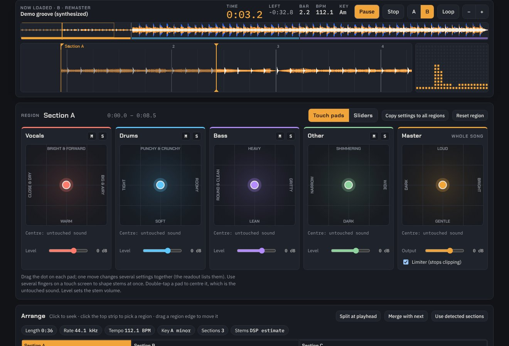

# Remaster Lab

**Open any song, see how it's built, pull it apart into stems with AI, and remaster it your way, section by section. Then keep your own version.**

Remaster Lab is a free, open-source audio workstation that runs in your browser. It is made for people who listen closely: you can make the bass in the drop crunchier, shorten the reverb on the vocal in the chorus, or brighten the hats in the intro, and hear the result against the original at the press of a key.



## What it does

| | |
| --- | --- |
| **See the song** | Scrolling 3-band waveform with beat grid and bar counter (DJ-software style), full-song overview, spectrogram, six frequency bands, tempo, key and detected sections (intro, verse, chorus…) |
| **Read the maths** | An *equation view* writes the moment under the playhead as a sum of sine waves, e.g. `0.025·sin(2π·175.1t + 5.30) + …`, and plots it over the real waveform |
| **Recognise songs** | Shazam-style fingerprinting (constellation peaks → hashes). Every song you open goes into a local library; reopen it, even renamed, and it is recognised with its saved versions. Identify short clips too |
| **Split into stems** | Vocals, drums, bass and other, with **HTDemucs** (Meta AI's open-source model) running **on your computer**, on a server you run, or from stem files you already have. A fast built-in DSP split is used until then |
| **Remaster per section** | Regions on a timeline (seeded from the detected sections). Each stem in each region has gain, 3-band EQ, crunch (saturation), punch (compression), stereo width, reverb and decay |
| **Touch pads** | One 2D pad per stem: a single finger move changes several settings together ("close & dry" → "big & airy", "lean" → "heavy"). Multi-touch, keyboard accessible, with a readout of exactly what changed. Switch to sliders any time |
| **Compare and keep** | A/B against the original instantly, loop a region, save named versions (recipes), render a lossless WAV faster than real time, keep renders in "My remasters" |

Everything runs locally. In browser mode your audio never leaves your machine.

## Quick start

You need Python 3 (to build and serve the page) and a recent Chrome, Edge or Firefox.

```bash
git clone https://github.com/AviralGupta2211/remaster-lab.git
cd remaster-lab
python3 web/build.py                 # builds web/dist/index.html
cd web/dist && python3 -m http.server 8080
```

Open <http://localhost:8080>. A synthesized demo track loads straight away; press **Open song** or drop an MP3, WAV, FLAC or M4A onto the page.

> Opening `index.html` directly from disk (`file://`) mostly works, but the AI split needs the page served over http(s).

### Turn on "Split with AI"

The in-browser AI split needs the model files next to the page. Build them once from the official Demucs weights (about 5 minutes, needs PyTorch):

```bash
pip install torch demucs onnx onnxscript onnxruntime numpy
python3 tools/build_model.py --verify    # writes web/dist/model/ (≈112 MB), checks it against PyTorch
```

The first split in a browser downloads the model; after that it is cached by the browser.

## Three ways to get AI stems

| Route | How | Speed (measured) | Privacy |
| --- | --- | --- | --- |
| **In the browser** | **Split with AI** → **Start AI split** | About 4× the song length on one CPU thread of a 2-core cloud VM; laptops are faster, and WebGPU is used when the browser offers it | Audio stays on your computer |
| **Your own server** | Run [`server/`](server/README.md), then enter its address under *Use a separation server* | 30 s of audio in 27 s on the same 2-core CPU; a GPU is far faster | Audio goes only to the server you run |
| **Stem files** | **Load stem files** and pick four files named with *vocals*, *drums*, *bass*, *other* (Demucs output works as is) | Instant | Local |

Whichever route you use, "other" is rebuilt as *original − vocals − drums − bass*. The four stems always add back up to the exact original, so an untouched pad sounds exactly like the source.

## How it works

- **Analysis** (`web/src/dsp.js`, in a Web Worker): one STFT (2048-sample window, 512 hop) drives the spectrogram, band energies, spectral-flux onset curve, tempo (autocorrelation with a tempo prior), key (chroma correlated with Krumhansl profiles) and sections (self-similarity matrix with checkerboard novelty).
- **Fingerprinting**: audio resampled to 11 025 Hz, local spectral peaks (about 25 per second) paired into 24-bit hashes `f1 | f2 | Δt`; a match is the time offset most hashes agree on.
- **DSP stems**: harmonic/percussive separation by median filtering, a low band for bass and a centre-channel vocal band. The masks sum to one, so the stems sum to the original.
- **AI stems** (`web/src/aisplit.js`, `web/src/ai-worker.js`): HTDemucs exported to ONNX without its STFT/iSTFT, which are reimplemented in JavaScript and match Demucs to ~136 dB. Weights ship as float16 (half the download, ~45–80 dB from full precision). It runs in 7.8 s chunks with 25% triangular overlap-add, exactly like `demucs.apply_model`, via [ONNX Runtime Web](https://onnxruntime.ai/).
- **Remaster engine** (`web/src/app.js`): one Web Audio graph for both live playback and offline rendering, so what you hear is what you export. Per stem: width (mid/side), 3-band EQ, parallel tanh saturation, compressor, fader, and sends to three shared reverbs (0.6 s, 1.8 s, 4 s) that the decay control crossfades between. Region changes are scheduled as 60 ms parameter ramps.

More detail in [docs/architecture.md](docs/architecture.md).

## Project layout

```
web/src/        page.html, app.js (UI + audio engine), dsp.js (analysis, DSP stems, fingerprints),
                aisplit.js + ai-worker.js (in-browser HTDemucs)
web/build.py    inlines everything into web/dist/index.html
tools/          build_model.py (ONNX export + packaging of the browser model)
server/         FastAPI + Demucs separation server, Dockerfile
tests/run.js    dependency-free tests (node tests/run.js)
docs/           architecture notes, screenshot
```

## Roadmap

- 6-stem separation (adds guitar and piano), then more instruments as models allow
- Presets ("warm vinyl", "club bass", "vocal up front") and *match a reference track*
- Loudness targets (LUFS) and a true-peak limiter
- Multi-threaded in-browser AI on hosts that send cross-origin isolation headers
- A small player for listening to your saved remasters

Ideas and pull requests are welcome; see [CONTRIBUTING.md](CONTRIBUTING.md).

## Privacy and security

- No accounts, no analytics, no API keys. Settings, fingerprints, versions and renders live in your browser's storage.
- The server reads its optional access token from the `REMASTER_LAB_TOKEN` environment variable; nothing secret belongs in this repository. CI scans every push for leaked secrets.
- Found a vulnerability? See [SECURITY.md](SECURITY.md).

## A note on music rights

Remaster Lab is for personal listening and learning. Use audio you have the right to use, and don't distribute remastered copies of other people's recordings.

## Credits

- [Demucs](https://github.com/facebookresearch/demucs) by Alexandre Défossez et al., Meta AI (MIT licence). The model weights are Meta's.
- [ONNX Runtime Web](https://github.com/microsoft/onnxruntime) by Microsoft (MIT licence).
- Fingerprinting follows Avery Wang, *An Industrial-Strength Audio Search Algorithm* (ISMIR 2003).
- Fonts: Chakra Petch, IBM Plex Sans and IBM Plex Mono via Google Fonts (SIL Open Font License).

## License

[MIT](LICENSE)
